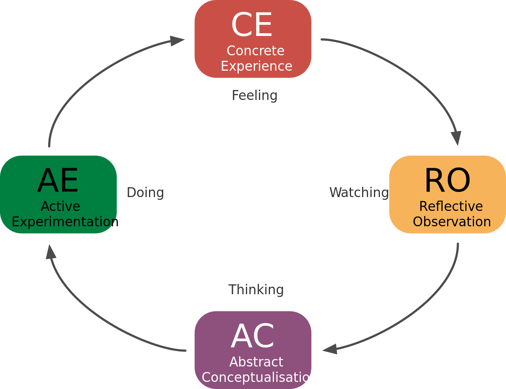

## Topic 2: Key Principles of Online Course Design

If you know any Instructional Designers...this section is at the heart of what we do!  What makes a good online course?  A good learning activity?  How do we facilitate learning experiences that allow our students to engage with the topics, grow in their critical thinking skills, and collaborate with others?

Below we focus on three key principles in online learning.  As you read and engage with the learning activities, consider your own view of learning and teaching, and how this impacts your course design and teaching methods.

#### #1: Learning is an EXPERIENCE
A key approach in course design is experiential learning - learning by DOING.  
Simon Fraser University (2010) has defined experiential learning as:

! "the strategic, active engagement of students in opportunities to learn through doing, and reflection on those activities, which empowers them to apply their theoretical knowledge to practical endeavours in a multitude of settings inside and outside of the classroom."

The **Experiential Learning** model was developed in the 70's by Kolb (influences by Piaget and Dewey), and explains a process of learning that is active and reflective.

*Source: The four steps in Kolb cycle. From Experiential Learning Theories by David Kolb. [Wikipedia](https://en.wikipedia.org/wiki/File:The_Four_Steps_in_Kolb_Cycle.svg)*

Other key models related to experiential learning are:
- active learning,
- inquiry- based learning,
- problem-based learning, and
- collaborative learning.

### Learning Activities
[plugin:content-inject](../_1-5)

### #2: Learning should be ACCESSIBLE
We talked a bit about multi-access in the previous topic, but I want to focus on the barriers that might prevent students from learning.
- unpredictable internet access
- confusing technology (pwpt, Moodle, etc.)
- lack of motivation
- lack of support
- course is difficult to navigate
- language/cultural barriers

What other concerns have you heard from students, or that you have felt yourself as you encounter a new learning tool?

As we design our courses, we want to incorporate inclusive learning, or principles of **Universal Design for Learning** (UDL). The Higher Education Opportunity Act of 2008 defines this approach to curriculum and teaching:

! “The term ‘universal design for learning’ means a scientifically valid framework for guiding educational practice that–
! provides flexibility in the ways information is presented, in the ways students respond or demonstrate knowledge and skills, and in the ways students are engaged; and
! reduces barriers in instruction, provides appropriate accommodations, supports, and challenges, and maintains high achievement expectations for all students, including students with disabilities and students who are limited English proficient” (110th Congress, 2008).

In the learning activity below, there are several resources on Universal Design for Learning.  Before you scan those, take a look at the following graphic organizer and consider the steps you can take to design your courses for all learners.

### Learning Activities
[plugin:content-inject](../_1-6)

### #3: Learning should be TRANSFORMATIONAL
Wow! That is quite an aspiration!  And yet, how many stories have you heard from students or fellow faculty that a course has impacted students in a profound way?  Why do students come to Trinity in the first place?  What do we hope they gain from this education?  

In many of our courses, a common goal is transformational learning, but how do we promote this?

### Learning Activities
[plugin:content-inject](../_1-7)
