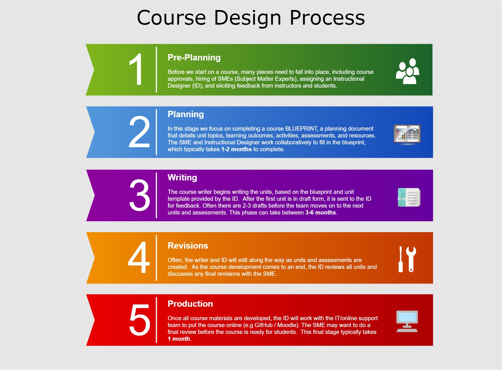

## Topic 1: Course Design Process

Imagine you win the lottery and have a couple million dollars to design your dream house.  What would it look like?  Where would it be?  Who would live in it with you?

If you had to actually do the work to map out the blueprint of your house, what are the components?  What is the layout and design?  What motivates you to make those design choices?

Designing a course is like planning, building, and moving into a house.  You start with asking some key questions:
- What is the course?  What are the ‘big picture‘ ideas or the main take-aways?
- How does this course fit in with the program?
- If a previous course exists, has there been any feedback from students and instructors?
…and the most important questions:
- Who are the students?  What is the typical age, gender, work experience, culture, etc.? What are their interests, learning styles, and needs?​

Another strategy to use before getting into the details of a course is identifying the Big Ideas (Wiggins & McTighe, 2005). Below is an image from Stanford University (adapted) that takes us through the process of deciding the big ideas, essential questions, key knowledge and skills, and learning activities.

### Learning Activities
[plugin:content-inject](../_2-1)

### Instructional Design Models
There are several key models that influence the way we design online courses. Two that we'll focus on are the ADDIE model and Backwards Design.  

The **ADDIE Process** illustrates 5 phases of course development:

Source: [Wikimedia] (https://commons.wikimedia.org/wiki/File:Skema_ADDIE.jpg)

**Backwards Design** (Fink, 2003; Wiggins & McTighe, 2005) is where we first focus on the target: what knowledge, skills or attitudes do we want students to have at the end of the course?  Second, how will they demonstrate this?  Finally, what learning experiences will help students achieve this?

### Learning Activities
[plugin:content-inject](../_2-2)

### Course Design Process at TWU
Every course is different, and every course design experience is different.  In this section we'd like to briefly share a typical process we follow in creating and revising our online courses at TWU.

!!! Please Note: This process may not apply to your course! With the time constraints, it certainly may not apply to the many faculty who may need to put their summer courses online asap!

Our Instructional Design team at TWU generally follows the following development process:

#### Planning (Creating a Course Blueprint)
The most important part of course design is the planning. After the initial stages of needs analysis (what do the students/instructors need) and hiring phase (who will write the course), the development teach creates a plan, or a blueprint of the course.

In developing this document we focus on the development of learning outcomes that are measurable, and then ensure that the supporting activities and assessments are mapped directly to these outcomes.

Below are some examples of part of a blueprint document.  For a current blueprint template for TWU courses, click on the following link: [TWU Course Blueprint Template](https://docs.google.com/document/d/1XJ27S2OeEW01JFpICjWtvsYLj1a0SpD9dy7yoX8ttAQ/edit?usp=sharing)

!!! Note in the blueprint that there is a table for 10 units.  This does not apply to all courses!!  If you happen to work with an Instructional Designer in planning out your course, a key question will be how to organize the learning/content.  This may work out to be 10 key units for a 12 week course, but each course is different.

Let's move on to the next topic, where will address the next steps in the process, including creating content, activities and assessments.
