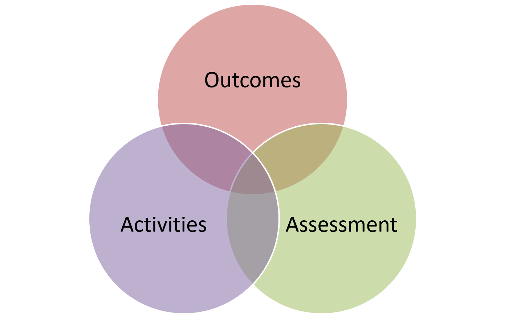

## Topic 2: Anatomy of an Online Course

Here is where we get into the nitty-gritty of what a course looks like!  Again, let me repeat that every course is different and may not have these elements.  

#### Section 1: Overview
We typically start with an overview of what is in the unit - what are the key ideas, how does it connect to the rest of the course, why does this matter to students, etc.  This is one way the instructor can connect to students, to set the stage for learning, and to really bring in your teacher’s voice or presence.  Many instructors use video to share the unit overview, as this can personalize the experience for students.

The Unit Overview also includes the unit Topics, Learning Outcomes, Activities, and Resources. We include these details want to allow students to plan their week, make time for activities and assessments, ensure they have the resources, and to know what the purpose is (learning outcomes).

**Learning Outcomes**
Learning outcomes describe what learners will be able to know, do and value after a learning experience.

They clearly explain the knowledge, skills, and attitudes students will gain through a course.

It is crucial to have measurable learning outcomes listed on the course outline, as they communicate expectations to the learner and help guide the instructor.  We also encourage instructors to list the learning outcomes for each unit/lesson, as again, this helps students know what to aim for.

**SMART Learning Outcomes**

The diagram above illustrates the five key principles in designing learning outcomes.  They must be specific and clear, instructors must be able to measure successful completion of an outcome, and learners must be able to achieve them.  Learning outcomes should also be relevant to the course and achievable  within the time period allotted.

Making Connections

Once the curriculum team decides the learning outcomes for each lesson, they  decide how students will demonstrate their learning (assessment).  Sometimes deign starts with the assessment in mind, and then we work backwards to examine what that assessment tells us about students learning.
Next, they consider how to prepare learners for the assessments (learning activities).

It’s crucial that there are clear connections between the outcomes, activities, and assessments.

Connecting to Activities & Assessments
​Instructional designers often use Bloom’s Taxonomy to help write learning outcomes. The graphic below lists the possible verbs to use in a learning outcome, as well as examples of activities and/or assessments.  Just to give one example, if you are assessing the domain of analysis by asking student to compare, you may ask them to create and administer a survey.
Picture

More on Learning Outcomes!
Not quite satisfied with the overview above? Are you craving more theory & examples?  Well, you’re in luck!  Below are some juicy outcomes tidbits that might help you write better outcomes for your courses.
The 6 Facets of Understanding

Understanding by Design is a great resource from Wiggins and McTighe (2005) and it can help you be more specific in writing the outcomes for your course.
When we say the student will understand something, it’s pretty vague.  How will they understand it?  To what level or depth?  How will they prove their understanding?
The image below illustrates the facets of understanding one may have.  As instructors, our job is to have clear learning outcomes that explain the level of understanding we are looking for as we assess our students.
Wiggins & McTighe define understanding as being able to “teach it, use it, prove it, connect it, explain it, defend it, [and] read between the lines” (82).
As you write your outcomes, be clear on how students will demonstrate their understanding (by explaining, etc.).

Significant Learning:
Fink (2003) described learning as change in the learner.  How can we tell what has changed in our students, or how the course has impacted them?
In his book, Creating Significant Learning Experiences: An Integrated Approach to Designing Colleges Courses, he asks instructors to consider what students will take away from the course.  What are the long-term goals?  What will they remember?
The image here shows Fink’s Taxonomy of Significant Learning.  Consider the various categories of learning as you write your outcomes.  Will students apply their learning?  Learn about themselves or others?  Value a new idea or perspective? Become a self-directed learner?
Picture

SOLO Taxonomy
Another great resource that can help guide your course design is the structure of observed learning outcomes (SOLO) created by John Biggs and K. Colis. Below are two images showing the 5 levels of understanding.
_Taxonomy.png)

*Source: Diagram giving an overview of the SOLO Taxonomy approach. [Wikipedia](https://commons.wikimedia.org/wiki/File:Structure_of_Observed_Learning_Outcomes_(SOLO)_Taxonomy.png)*

Revised Bloom’s Taxonomy
And finally…the taxonomy that tops all other taxonomies…Bloom!  As a teacher, I’ve often relied on Benjamin Bloom’s classification of learning objectives, and the many articles and images that have been inspired by his ideas.  Below is a final image showing the taxonomy, but be sure to check out the following websites for more great ideas:
Revised Bloom’s Taxonomy from Iowa State University
Bloom’s Taxonomy Revised: Key Words, Model Questions and Instructional Strategies
Bloom’s Digital Taxonomy by Andrew Churches
Bloom et al.’s Taxonomy of the Cognitive Domain (Dr. William G. Huitt, Valdosta State University)

learning outcomes - (& connections to TWU SLOs)
content (teacher/student generated)
learning activities
assessment

### Learning Activities
[plugin:content-inject](../_2-3)
