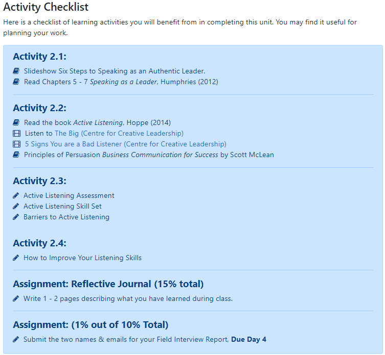

## Unit Overview
We typically start with an overview of what is in the unit - what are the key ideas, how does it connect to the rest of the course, why does this matter to students, etc.  This is one way the instructor can connect to students, to set the stage for learning, and to really bring in your teacher’s voice or presence.  Many instructors use video to share the unit overview, as this can personalize the experience for students.

The Unit Overview also includes the unit Topics, Learning Outcomes, Activities, and Resources. We include these details as it allows students to plan their week, make time for activities and assessments, ensure they have the required resources, and to know what the purpose is of the unit (learning outcomes).

### Topics
After giving a preview of the unit in the Overview section, we typically list the topics.  Now, you may think that your unit/lesson is just one main topic, but consider if that can be broken down a bit more.  A bit later we'll discuss why we "chunk" information, but for now as you think about a unit and fill out your course blueprint, try to break down your main topic into subtopics.

### Learning Outcomes
Learning outcomes describe what learners will be able to *know, do and value* after a learning experience. They clearly explain the knowledge, skills, and attitudes students will gain through a course.

It is crucial to have measurable learning outcomes listed on the course outline, as they communicate expectations to the learner and help guide the instructor.  We also encourage instructors to list the learning outcomes for each unit/lesson, as again, this helps students know what to aim for.

*Writing SMART Learning Outcomes*

The diagram above illustrates the five key principles in designing learning outcomes.  They must be specific and clear, instructors must be able to measure successful completion of an outcome, and learners must be able to achieve them.  Learning outcomes should also be relevant to the course and achievable  within the time period allotted.

For more examples of learning outcomes, see our course text *[Teaching in a Digital Age](https://pressbooks.bccampus.ca/teachinginadigitalagev2/part/chapter-2-the-nature-of-knowledge-and-the-implications-for-teaching/)* by Tony Bates.

---

[details="Want to know more about Learning Outcomes? Click to Open!"]

**Bloom’s Taxonomy**

​Instructional designers often use Bloom’s Taxonomy to help write learning outcomes. The graphics below lists possible verbs to use in a learning outcome, as well as examples of activities and/or assessments.  Just to give one example, if you are assessing the domain of analysis by asking student to compare, you may ask them to create and administer a survey.  As you write your outcomes, what **[Higher Order Thinking Skills](https://en.wikipedia.org/wiki/Higher-order_thinking) (HOTS)** are you promoting?

*"Bloom's Taxonomy" [flickr photo by Vandy CFT](https://flickr.com/photos/vandycft/29428436431) shared under a Creative Commons (BY) license*

For more, see [Revised Bloom’s Taxonomy](https://www.celt.iastate.edu/teaching/effective-teaching-practices/revised-blooms-taxonomy/) from Iowa State University.

**Significant Learning**

Fink (2003) described learning as change in the learner.  How can we tell what has changed in our students, or how the course has impacted them?
In his book, *Creating Significant Learning Experiences: An Integrated Approach to Designing Colleges Courses*, he asks instructors to consider what students will take away from the course.  What are the long-term goals?  What will they remember?

The image here shows Fink’s Taxonomy of Significant Learning.  Consider the various categories of learning as you write your outcomes.  Will students apply their learning?  Learn about themselves or others?  Value a new idea or perspective? Become a self-directed learner?
 <small><a title="Fink Significant Learning" href="https://flickr.com/photos/lauradahl/2897475124">Fink Significant Learning</a> flickr photo by <a href="https://flickr.com/people/lauradahl">Laura B. Dahl</a> shared under a <a href="https://creativecommons.org/licenses/by-nc/2.0/">Creative Commons (BY-NC) license</a> </small>

**SOLO Taxonomy**

Another great resource that can help you write effective learning outcomes is the *Structure of Observed Learning Outcomes (SOLO)* created by John Biggs and K. Colis. The images below show the 5 levels of understanding.  As you write your outcomes, consider the increasing complexity of understanding students can demonstrate through assessments.  How will they know what level they are at?  Try to incorporate descriptions in a grading rubric that explain the connections you want students to make (e.g. analyze, compare, hypothesize, predict, etc.)  

Source: Diagram giving an overview of the SOLO Taxonomy approach. [Wikipedia](https://commons.wikimedia.org/wiki/File:Structure_of_Observed_Learning_Outcomes_SOLO_Taxonomy.png)

For more information, see [SOLO Taxonomy - John Biggs](https://www.johnbiggs.com.au/academic/solo-taxonomy/).

Other great resources:
- [Learning Outcome Generator](https://elearn.sitehost.iu.edu/courses/tos/gen2/)
- [Learning Objectives Maker](https://learning-objectives.easygenerator.com/)
[/details]

---

### Activities and Assessments
In the Overview section we often have an Activity Checklist - some indication of what is required of students in the units.  This could be a brief list of readings/videos, learning activities, and assessments.
*Sample Activity Checklist*

We will dive more the topics of activities and assessments a bit later.

### Resource List
A final piece of information in the Unit Overview section is the resource list.  We often list just the main resource (e.g. course text) and then let students know the rest of the resources will be linked within the unit.  This allows students to plan for any texts/articles they must purchase.  Listing the resources throughout the unit allows for scaffolding of learning, as well as a way to provide context and guiding questions for students, rather than a master list of resources.

### Learning Activities
[plugin:content-inject](../../_2-4)
