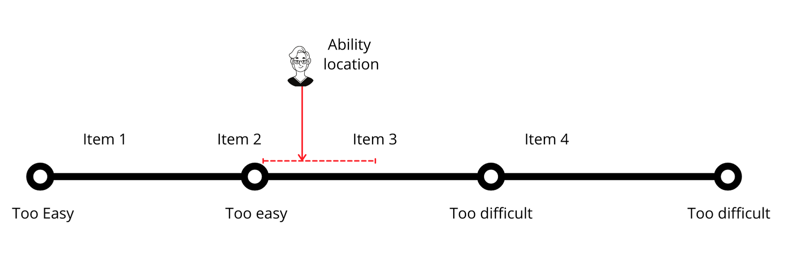

🌊 What is the mass of a cubic centimetre of water?

📏 How many kilometres are there between TWU Langley and TWU Richmond?

📚 What is the volume of books in the library?

Each of these questions may be answered with varying degrees of precision as they represent constructs (mass, distance, volume) which may be observed and *quantified*. We can assign not only numbers on an ordinal scale (x<y), but also as an interval (x+1=y; y+1=z), and as a ratio (interval scale with true 0). In other words, we can *measure* the mass of a gram of water, the distance between two points, and the volume of a certain number of books.

👩🏾‍🎓 How much did you learn?

📖 How much do you know?

🎨 How artistic are you?

Each of these questions, by contrast, are much more difficult to answer as they represent constructs which *cannot be directly observed*. These constructs are *not quantifiable* despite the fact that we smuggle in language that suggests we can ('how much...'). At best, and under the most ideal circumstances, we could ask a series of questions to a person before and after a learning experience and compare the results. However, what units would this 'learning' be measured in? How would we know that answering a particular item correctly represents true knowledge of a particular construct vs. just a lucky guess; or that answering that same item incorrectly represents lack of knowledge vs. the effects of hunger or fatigue? Can we know how likely a particular item is to be answered correctly by a person with a given level of ability? How do we know if a particular item is likely to be answered incorrectly by members of a particular group of people (younger people vs. older people).

We have certainly devised a number of proxies for quantifying learning, including using selected-response tests and subjecting the results to psychometric analysis, but those are just that, proxies. They do not *measure* learning or achievement in the way that we often assume they do. For instance, the fundamental equation in Classical Test Theory is

$X=T-E$

where

$X$ = the observed score on a test

$T$ = the true score an examinee would get if their score was based *only* on their ability

$E$ = error; any random variability not attributable to an examinees ability (fatigue, guessing) (Finch & French, 2019)

When an examinee answers a particular number of questions correctly on a test, say, 37.5/50 (75%), what does that mean? How does an examinee, A, who answered the first 37.5 questions correctly compare to another examinee, B, who answered the last 37.5 questions correctly? What about the examinee, C, who scored 37.5/50 and who was up the whole night before the exam because they were called into work a night shift? Clearly, none of these situations are parallel, yet all three examinees end up with the same observed score ($X$), when we know that their true scores ($T$) would in all likelihood be very different.

There is ***always*** error ($E$) when we try to measure ability, a latent construct. The first question is 'how much error?', and the second is 'in which direction?', as error results in both inflated and deflated observed scores ($X$). This should decrease your confidence in the precision of your grading metrics.

Obviously, we want to eliminate sources of information not attributable to learner ability in relation to what our learners know and can do in order to get as close to $T$ as possible. Theoretically, the way to do that, since $E$ is random, is to test each student an infinite number of times and average their scores. Practically, however, ...well...you know.

That brings us to this idea of averages. We saw how 3 learners with different abilities could score the same on a test, hiding critical information about their true ability. A reasonable response to this problem might seem to be to calculate final scores from the average of several scores throughout the semester. We might assume that doing so will allow learners, like C, with higher ability to bring up their final score by demonstrating something closer to their true ability on subsequent tasks. Let's assume that we have a course with 4 graded items, each worth 25% of the total. We might end up with something like this.

| Learner | Item 1 | Item 2| Item 3 | Item 4 | Final|
|:---:|:---:|:---:|:---:|:---:|:---:|
|A    | 75%  | 75%  | 75%  | 75%  | 75%  |
|B   | 75%  | 50%  | 75%  | 100%  | 75%   |
|C   | 75%  | 100%  | 75%  | 50%  | 75%  |

As you can see, we might have some confidence that A is deserving of 75% as a final grade, but what things are hidden by the scores achieved by B and C? If it seems like B and C might have different abilities in relation to the outcomes, why would we assign them the same grades? How do we know that A's true ability isn't obscured by error in the same way as B and C might be? Doesn't it seem like B made the most progress during the course while C just got more confused? If B was able to demonstrate such mastery at the end of the course, why would we penalize them for knowing less towards the beginning of the semester?

However, the real trouble with using averages is that we are using *ordinal data*. We might know that one learner is more capable than another, but you cannot know *how much* more capable they are. Recall that you cannot *measure* or *quantify* learning, you can only *infer* from learner work and provide a subjective *rating*. Further, if learning can't be quantified, the ratings we use cannot be averaged. For example, we cannot determine the average of the following ratings:

> good, fair, good, excellent, poor, fair, excellent, superior

In the same way, we can't determine an average of these ratings:

> C+, C, B, A, C-, C, A, A+

*Even if we associate those ratings with numbers or percentages or if we begin with numbers that we then associate with letters.*

For example, imagine a scenario where you receive a hands-free phone call from someone who is looking for the exit to TWU. You ask a series of questions:

- Q: Are you coming from Abbotsford or Vancouver?
    - A: Abbotsford
- Have you passed the 264th Ave exit?
    - Yes.
- Have you passed the 232nd Ave exit?
    - Yes.
- Have you passed TWU on the south side of the highway?
    - No.

At this point, you know within a range of possible locations, roughly where the person is on the highway.

It is impossible to know from this data, however, their precise location between 232nd Ave and TWU (even if we presume they are stationary). We cannot determine that they are 357 m beyond the 232nd Ave on-ramp, or that they are 50% of the way through the train overpass. The instrument used to determine their location is not that precise. In the same way, we cannot determine a learner's precise location on a scale that measures ability.

In examinations, we ask questions of learners to gauge their ability. In psychometrics, a learner's *ability* is considered on the same scale as the *difficulty* of an item.

- Item 1
    - Correct
- Item 2
    - Correct
- Item 3
    - Incorrect
- Item 4
    - Incorrect

In this example, we can infer that this learner's *ability* matches the *difficulty* somewhere between the difficulty levels of Item 2 and Item 3. Notice that this is not a precise measurement, but rather a range. The smaller the range between the items (greater precision), the more data we need to gather to have confidence in a learner's ability. This is why using a percentage scale 0-100% is not justified. With this scale, with 101 possible 'locations' is far more precise than our instruments can measure.

The implication of this is that as assessors of learning, we should be cognizant that the tools we have at our disposal are blunt and that the precision with which we can determine a learner's true ability is very fuzzy. This means that we should focus on a few broad categories of ratings as opposed to more "precise" pseudo-measurements. The more precise our categories are, the more likely we are to mis-categorize a learner. It is very difficult or impossible to discern the difference between a paper that is scored a 78% and one that is scored an 80%, but it is much easier to discern between a paper that 'meets expectations' and one that 'exceeds expectations'. Guskey and Brookhart (2019) report that the probable range of error on a 101 point scale is +/- 5-6%, which means that assessors are unable to make meaningful distinctions within 10-12 points.

These distinctions might seem inconsequential at first, but if you consider that the difference between a 78 and an 80 may have implications for scholarships, employment, immigration status, and family relationships, it becomes a bit different story.

!!! ### Learning Activity
!!! *Consider the **TWU Standard Grading System***  
!!! [embedly url="https://www.twu.ca/about/policies-guidelines/university-standard-grading-system"]   
!!! As you can see, in alignment with recommendations from Guskey and Brookhart (2019), there are only five categories of grades (A, B, C, D, F) along with rich descriptions of what work looks like at each level, making it relatively easier to categorize learners accurately.
!!! As you think about the TWU Standard Grading System in light of your own grading practices, what do you notice? What do you wonder? If you'd like, publish a post in Moodle or on your own site in which you consider your views on grading in your own classes.

### References

Finch, W. H., & French, B. F. (2019). *Educational and psychological measurement.* Routledge.

Guskey, T. R., & Brookhart, S. M. (Eds.). (2019). *What we know about grading: What works, what doesn’t, and what’s next.* ASCD.
