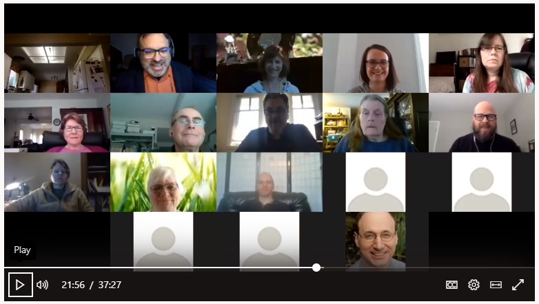
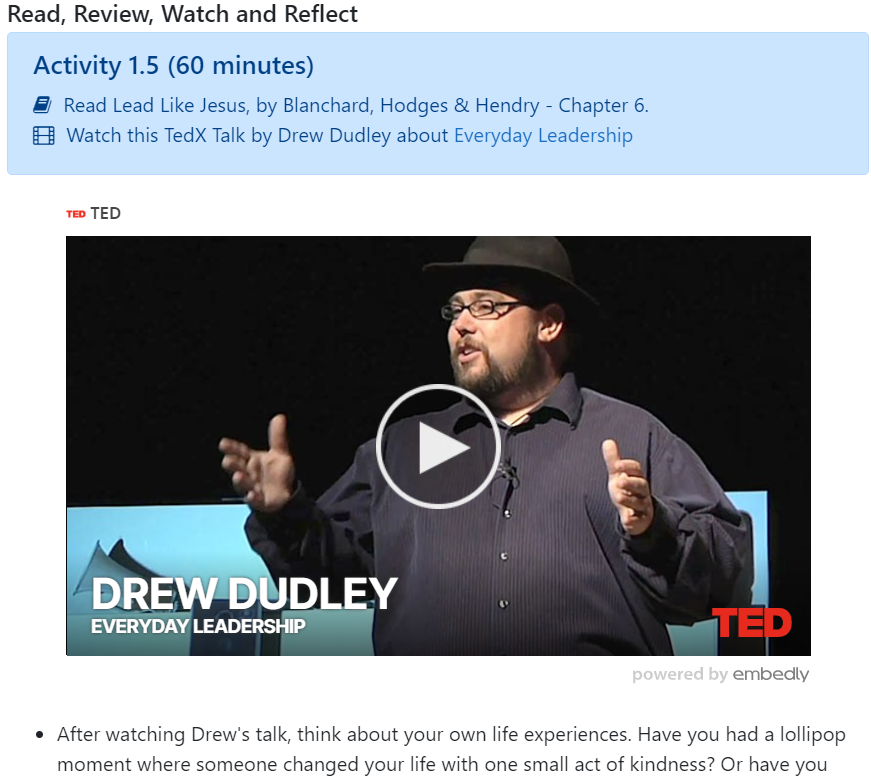

## Unit Topics

After we've given an Overview to the students about what is in the lesson/unit, the next step is to teach the topics.  But how do we do this online?  Hold a 1-3 hour Zoom session?  (*Often the answer is "NO!"*)  The teaching techniques you use in the classroom do not necessarily transfer to online.  So, what are effective methods for teaching content in an online course?

### Using PowerPoint Slideshows
When instructors are asked to put their course online, the default for many is to post the PowerPoints that they have created for their face-to-face classroom.  The problem is...the online course is not face-to-face!! PowerPoint presentations were designed as a tool for when the speaker is *presenting*.  If you simply put a 60 slide pwpt online for students to view - they are missing the teaching part!
Here are some ways to use PowerPoint presentations in your online course:
- **Add audio or video:**  Please consider adding a voice to your slideshow, as the personal explanation of the slides is crucial for learning.
- **Shorten your presentations:**  60 slides is a lot of content to digest at one time.  Consider chunking your presentations into smaller subtopics so students can organize their learning and pause for interaction (see next point).
- **Pause for interaction!** Add learning activities in the PowerPoints, such as posing questions for students to answer in their notes.
- And finally...**Don't use PowerPoint!** For an online course, you have the option of simply putting the "teaching content" from your PowerPoint right into the course (like I'm doing here).  Please consider what pieces of the pwpt need to remain in slideshow format, and what can simply be in the text.

### Using Videos
Videos are a great way to teach in an online course - and there are a variety of ways to do this.

- Record your synchronous Zoom sessions.  Our TOne course for example is doing this, for several reasons:
  - It's a way to provide extra content to learners.
  - It provides a record of the sessions so students can review.
  - It allows students that were unable to attend the session to view the session at their own time.
  - It builds community!  Some of our sessions for example are simply for Q&A and are learner-directed.  We hope this format facilitates a *Community of Inquiry* where faculty can collaborate and share ideas.

| HIST 107 Example Video | WRSH 101 Example Video  |
|----------------|----------------|
|                |               |

| TOne session Example Video | TED Talk Example Video  |
|----------------|----------------|
|     |  |

! *Note:* We'll go into more detail about how to use video later in the course.  For now, if you're interested in learning more about Zoom, see [Using Video Conferencing](http://create.twu.ca/help/online-learning-on-ramp/running-a-session/conferencing)

### Using Images & Graphic Organizers

Consider the images used in this website. Do they grab your attention? Make you reflect on prior learning experiences? Pique your interest?  

Images can be powerful tools in your course design.  As you write your units, explore various images and graphic organizers to engage students, and bring meaning to the text.

**Finding Images for Your Course**
Here are a couple of great search engines to find images.  Please try to find free and open images – ones that have a Creative Commons license.
 - [Pixabay](http://pixabay.com/)
 - [Google Advanced Search](http://www.google.com/advanced_image_search)
 - [Wikimedia Commons](http://commons.wikimedia.org/wiki/Main_Page)
 - [Unsplash](https://unsplash.com/)
 - [Pexels](https://www.pexels.com/)
 - [Creative Commons](http://search.creativecommons.org/)
 - [Flickr Creative Commons](https://www.flickr.com/creativecommons)

### Learning Activities
[plugin:content-inject](../../_2-5)

### Chunking Your Topics
We've mentioned chunking a couple times in this unit, but what does it really mean, and why is it important?  Chunking "it "is the process of breaking down content into smaller, bite-sized bits of easily digestible information that are easy to comprehend, learn, and commit to memory" - [eLearningindustry.com](https://elearningindustry.com/content-chunking-engaging-course).
When we discussed the principles of accessibility earlier, this is a key idea.  As you write your units and put your course online, consider the lesson flow, the pauses for interaction (learning activities), and how best to organize content to help students learn.

### Learning Activities
[plugin:content-inject](../../_2-6)
