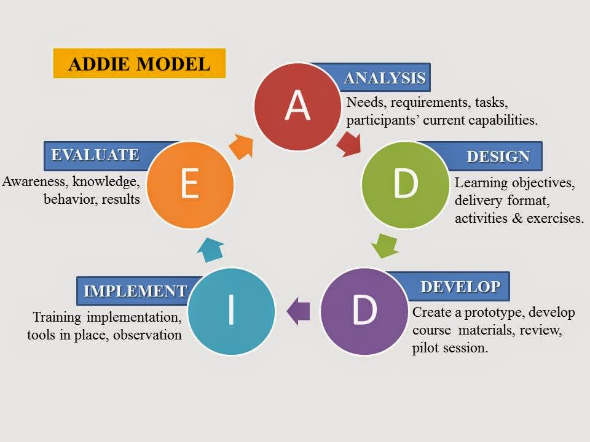

### Instructional Design Models
There are several key models that influence the way we design online courses. Two that we'll focus on are the ADDIE model and Backwards Design.  

The **ADDIE Process** illustrates 5 phases of course development:

*Source: [Wikimedia](https://commons.wikimedia.org/wiki/File:Skema_ADDIE.jpg)*

**Backwards Design** (Fink, 2003; Wiggins & McTighe, 2005) is where we first focus on the *target*: what knowledge, skills or attitudes do we want students to have at the end of the course?  Second, how will they *demonstrate* this?  Finally, what learning *experiences* will help students achieve this?

### Learning Activities
[plugin:content-inject](../../_2-2)
