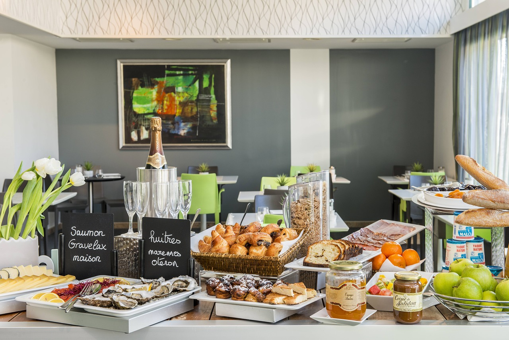

# Unit 3: Engaging Learning Activities & Assessment Strategies
## Overview
Congratulations!  You're halfway done the course!  So far, *(if you'll follow me on this metaphor)*, we've set the table (foundational ideas of design), you've looked at your menu (process & planning), had the appetizer (building community), and now for the smorgasbord of ideas!  *(Okay, not the best metaphor...but this course writer is currently pregnant, so food is on the brain!)*

*Image by <a href="https://pixabay.com/users/Cosyhotelslarochelle-5277027/?utm_source=link-attribution&amp;utm_medium=referral&amp;utm_campaign=image&amp;utm_content=2283843">Franck ROCHETEAU</a> from <a href="https://pixabay.com/?utm_source=link-attribution&amp;utm_medium=referral&amp;utm_campaign=image&amp;utm_content=2283843">Pixabay</a>*

In this unit, we hope to give you a hearty menu of ideas for learning activities and assessments to use in your course.  Some activity types may not work for your particular course, but consider the underlying principles of engagement, "messy" learning, and formative feedback.

## Topics
1. Purpose of Assessment
1. Activity & Assessment Ideas
1. Grading Rubrics & Peer Assessment

## Learning Outcomes
After completing this unit, you will be able to:
- explain the difference between formative and summative assessment;
- align assessments to learning outcomes and learning activities;
- design activities that promote skills including: critical and creative thinking, quantitative and qualitative reasoning, communication, research, and information literacy;
- explore practical assessment strategies that you can implement in your classes;
- evaluate the effectiveness of activities, resources and technology to support learning;
- create a grading rubric and/or detailed assignment guidelines.

## Activity Checklist

Here is a checklist of learning activities you will benefit from in completing this unit. You may find it useful for planning your week. *Note that there are numerous resources listed! Please feel free to browse and bookmark pages for a later read!*

[plugin:content-inject](_schedule)

## Resources:
- CORE TEXT: Bates, T. (2019). [Teaching in a digital age](https://pressbooks.bccampus.ca/teachinginadigitalagev2/). 2nd Edition. Victoria : BCcampus, BC Open Textbook Project.

- All other resources will be provided online.
