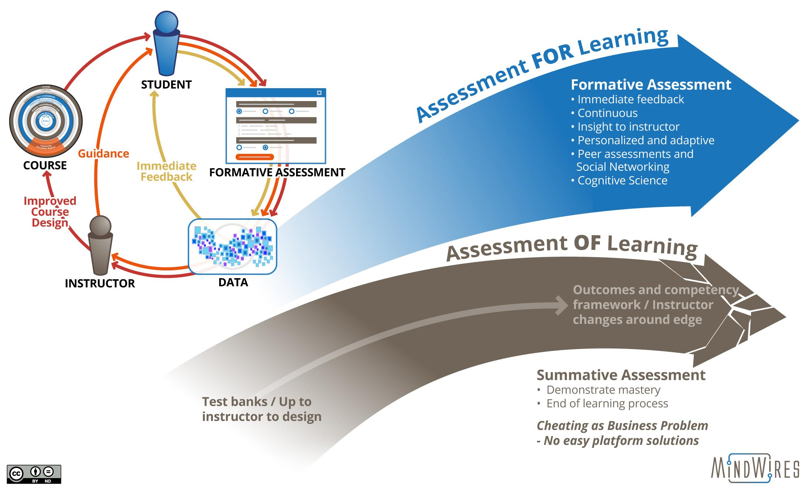

## Topic 1: Purpose of Assessment
Think about why assessment is a part of your course.  How does it benefit you and your learners?

Assessment demonstrates whether, and to what degree, the learner has met the learning outcomes for the course. It often lets the instructor know what concepts students struggle with which informs their teaching.  Assessments traditionally come in the form of tests or essays, but there are a number of other ways we can measure students’ understanding.
First, let’s focus on what assessment is.

### Understanding Assessment: Formative & Summative
Assessment can be *for, of,* and *as* learning.

! **Assessment for Learning**, a type of formative assessment, is utilized by teachers in order to gain an understanding of their students' knowledge and skills in order to guide instruction.

!!!! **Assessment of Learning** is a summative assessment used primarily to compare students and report progress.

!!! **Assessment as learning** is also a formative assessment which focuses on teaching students the metacognitive processes to evaluate their own learning and make adjustments.

*Source: UBC's [Assessment as Learning](http://etec.ctlt.ubc.ca/510wiki/Assessment_as_Learning)*

In our courses, we often think first of the **summative assessments** – the final test, unit quiz, essay, etc. that sums of students' knowledge.  These assessments allow students to demonstrate their learning of the course and we give them a final grade.

**Formative assessments** involve giving feedback and helping students learn from the assessment.  This ‘forms’ students knowledge so they can further show their understanding of a topic.  For example, practice quizzes before a final exam, peer reviews of an essay before the final paper, reflective journals, 1 minute papers, muddiest point, etc.,  There are numerous effective formative activities to help students and instructors assess learning before being graded.

|                    | **Summative Assessment**                                                             | **Formative Assessment**                                              |
|--------------------|--------------------------------------------------------------------------------------|-----------------------------------------------------------------------|
| When               | At the end of a learning activity                                                    | During a learning activity                                            |
| Goal               | To make a decision                                                                   | To improve learning                                                   |
| Feedback           | Final judgement                                                                      | Return to material                                                    |
| Frame of Reference | Sometimes normative (comparing each student against all others); sometimes criterion | Always criterion (evaluating students according to the same criteria) |

*Table from [Wikipedia](https://en.wikipedia.org/wiki/Formative_assessment#cite_note-11) citing Charting your course: How to prepare to teach more effectively, Atwood, 2000.*

---

### Alignment in Course Design
So how do we choose formative and summative assessemnts for our course?  An important part of course design is checking that there is alignment between assessments and learning outcomes.  If your learning outcome asks students to compare two theories, for example, how do they show you they can do that?  Often instructors will have their assessments in mind before they write their learning outcomes.  Whatever process you have, make sure that your course learning outcomes are assessed in your assignments.  Try to include these connections in your syllabus, as in the example below:

#### Learning Activities: Preparing for Assessments
One other alignment check that needs to be made in your course design is the connection between the assessments and the learning activities.  We mentioned in [Unit 2](https://learn.twu.ca/course/view.php?id=13628&section=2) that learning activities are designed to help students engage with the course topics, and that most are ungraded and optional. In order to motivate students to complete them, be explicit about the connections to the assignments and how the activities will help students succeed in their assessments.

Another reason to include learning activities in your online course is so that learners can practice the key concepts/questions and get *messy* with their learning.  Learning is a process, and activities allow for students to work through questions, organize their learning, explore solutions, and prepare for assessments.   

---

### Promoting Experiential Learning, Accessibility & Transformation

Let's refer back to Unit 1 and our key ideas that Learning should be an Experience, it should be Accessible, and it should be Transformational.  Do your learning activities and assessments promote these principles?

In [Engaging Adult Learners: Philosophy, Principles and Practices](http://northernc.on.ca/leid/docs/engagingadultlearners.pdf), Jim Bryson suggest 5 questions to ask yourself when choosing activities/assessments:  

! 1. Are the instructions, the purpose and the intended learning outcome(s) for this activity clear enough to be correctly understood by all students?
! 1. Is this activity fair? Will all students be able to understand and participate in it as a learning exercise? What choices do they have? Is it related to course content and laid out in a logical manner?
! 1. Will this activity add to my students' interest in content? Will they find it engaging and motivating? Will it stimulate curiosity and participation?
! 1. Is this activity relevant to the intended learning outcomes for the course? Is it relevant to student expectations? To my instructional goals?
! 1. Have I provided support for success in terms of information, curriculum content, discussion, interaction, activities and available resources?

As you decide what activities/assessments are appropriate for your course, refer back to these questions.

Next, consider the following quote:
!! ‘Can transformative learning theory be put into practice, and if yes, what are some of the differences it makes to the lives of learners?’...
!! ‘Can disorienting dilemmas be triggered by carefully designed exercises, and, if yes, what are the effects on student transformative learning?’
!! *From [Putting transformative learning theory into practice](https://files.eric.ed.gov/fulltext/EJ1059138.pdf)*.

How do we carfeully design exercises (activities & assessments) that transform learners?  How do we give them opportunities to explore and challenge their thinking?

Watch the following video about Trinity's Inquiry-Based Learning approach.

[plugin:youtube](https://www.youtube.com/watch?v=SCa9Nt3X1vU)

*Questions to Consider:*

Before you move on to the learning activity, take a moment to jot down your thoughts on these questions:

- Why do we assess?  
- How do I assess my students?  
- Are there opportunities for students to practice what they are learning before an assessment?
- Do I give formative feedback that will help students be more successful in future assignments?
- How do I design learning experiences that facilitate discovery, exploration, questioning, transformation, etc.?  

### Learning Activities
[plugin:content-inject](../_3-1)
